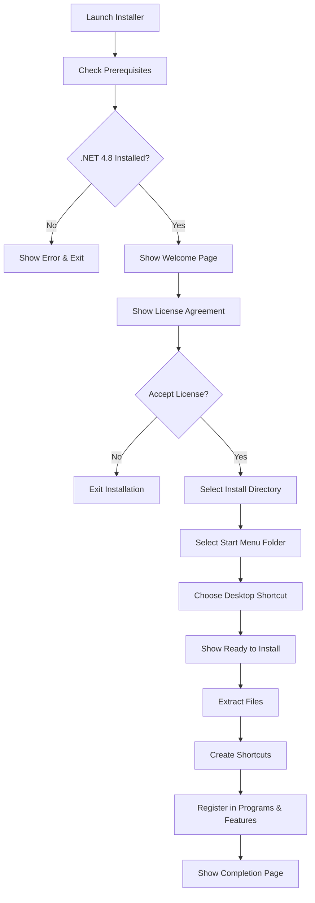

# Design Document: Inno Setup Installer for SMaRT

## Overview

This design specifies an Inno Setup-based installer for the SMaRT (SobekCM Management Tool) application. The installer packages a .NET Framework 4.8 Windows Forms application with all dependencies, third-party libraries, data files, and resources into a single executable installer.

The Inno Setup approach provides:
- Script-based configuration (.iss files) that is easier to maintain than WiX XML
- Smaller installer size through efficient compression
- Built-in support for common installation patterns (shortcuts, uninstall, upgrades)
- Pascal scripting for custom installation logic
- Wide compatibility with Windows systems

The installer targets Windows 10 and later (64-bit systems) and installs to Program Files (x86) for .NET Framework 4.8 compatibility.

## Architecture

### Installer Structure

The Inno Setup installer consists of a single .iss script file that defines:

1. **Setup Configuration**: Application metadata, version, publisher, installation paths
2. **File Packaging**: All application files, dependencies, and resources to include
3. **Shortcuts**: Start Menu and optional desktop shortcuts
4. **Installation Logic**: Prerequisites checking, upgrade handling, permissions
5. **User Interface**: Wizard pages for installation flow
6. **Custom Code**: Pascal scripts for advanced installation behavior

### Build Process

```
Source Files → Inno Setup Compiler → Single .exe Installer
```

The Inno Setup compiler (ISCC.exe) processes the .iss script and produces a self-extracting executable installer that contains all application files compressed with LZMA2.

### Installation Flow



### Upgrade Handling

The installer uses a consistent AppId to detect previous installations. When an older version is detected:

1. Inno Setup's built-in upgrade logic identifies the existing installation
2. The installer prompts the user or automatically removes the old version
3. Files are replaced with new versions
4. Registry entries are updated
5. Shortcuts are recreated

## Components and Interfaces

### Inno Setup Script Sections

#### [Setup] Section

Defines application metadata and installer behavior:

```ini
[Setup]
AppId={{GUID}}
AppName=UFDC SMaRT
AppVersion=3.52.0
AppPublisher=University of Florida Digital Collections
AppPublisherURL=http://ufdc.ufl.edu
DefaultDirName={autopf}\University of Florida\SMaRT
DefaultGroupName=UFDC SMaRT
OutputBaseFilename=UFDC_SMART_Setup_3.52.0
Compression=lzma2/max
SolidCompression=yes
ArchitecturesInstallIn64BitMode=x64
PrivilegesRequired=admin
LicenseFile=license.txt
UninstallDisplayIcon={app}\SMaRT.exe
```

Key directives:
- `AppId`: Unique GUID for upgrade detection (must remain constant across versions)
- `DefaultDirName`: Uses `{autopf}` constant which resolves to Program Files (x86) on 64-bit systems
- `Compression`: LZMA2 with maximum compression for smallest installer size
- `SolidCompression`: Compresses all files together for better compression ratio
- `ArchitecturesInstallIn64BitMode`: Specifies x64 compatibility
- `PrivilegesRequired`: Requests administrator privileges

#### [Files] Section

Specifies all files to package and their destination:

```ini
[Files]
; Main application
Source: "SMaRT\bin\Release\SMaRT.exe"; DestDir: "{app}"; Flags: ignoreversion
Source: "SMaRT\bin\Release\SMaRT.exe.config"; DestDir: "{app}"; Flags: ignoreversion

; Project dependencies
Source: "Custom_Grid\bin\Release\Custom_Grid.dll"; DestDir: "{app}"; Flags: ignoreversion
Source: "SobekCM_Core\bin\Release\SobekCM_Core.dll"; DestDir: "{app}"; Flags: ignoreversion
; ... (additional project DLLs)

; Third-party dependencies
Source: "DLLs\GemBox.Spreadsheet.dll"; DestDir: "{app}"; Flags: ignoreversion
Source: "DLLs\JIL\*.dll"; DestDir: "{app}"; Flags: ignoreversion
; ... (additional third-party DLLs)

; Data files
Source: "Data\*"; DestDir: "{app}\Data"; Flags: ignoreversion recursesubdirs

; Image resources
Source: "Images\*"; DestDir: "{app}\Images"; Flags: ignoreversion recursesubdirs
```

Key flags:
- `ignoreversion`: Always install the file regardless of version
- `recursesubdirs`: Include subdirectories when using wildcards

#### [Icons] Section

Creates shortcuts in Start Menu and optionally on desktop:

```ini
[Icons]
Name: "{group}\UFDC SMaRT"; Filename: "{app}\SMaRT.exe"; IconFilename: "{app}\Images\SMaRT.ico"
Name: "{group}\Uninstall UFDC SMaRT"; Filename: "{uninstallexe}"
Name: "{autodesktop}\UFDC SMaRT"; Filename: "{app}\SMaRT.exe"; IconFilename: "{app}\Images\SMaRT.ico"; Tasks: desktopicon
```

Constants:
- `{group}`: Start Menu folder (DefaultGroupName from [Setup])
- `{app}`: Installation directory
- `{uninstallexe}`: Automatically generated uninstaller
- `{autodesktop}`: User's desktop folder

#### [Tasks] Section

Defines optional installation tasks:

```ini
[Tasks]
Name: "desktopicon"; Description: "Create a &desktop shortcut"; GroupDescription: "Additional icons:"; Flags: checked
```

#### [Run] Section

Specifies actions to perform after installation:

```ini
[Run]
Filename: "{app}\SMaRT.exe"; Description: "Launch UFDC SMaRT"; Flags: nowait postinstall skipifsilent unchecked
```

Flags:
- `postinstall`: Run after installation completes
- `skipifsilent`: Don't run in silent mode
- `unchecked`: Don't check by default
- `nowait`: Don't wait for the program to exit

#### [Code] Section

Contains Pascal script for custom installation logic:

```pascal
[Code]
function InitializeSetup(): Boolean;
begin
  // Check for .NET Framework 4.8
  if not IsDotNetInstalled(net48, 0) then
  begin
    MsgBox('.NET Framework 4.8 is required. Please install it from: ' + 
           'https://dotnet.microsoft.com/download/dotnet-framework/net48', 
           mbError, MB_OK);
    Result := False;
  end
  else
    Result := True;
end;
```

### File Organization

The installer packages files into the following structure:

```
{app}\                          (Installation root)
├── SMaRT.exe                   (Main executable)
├── SMaRT.exe.config            (Application configuration)
├── Custom_Grid.dll             (Project dependency)
├── SobekCM_*.dll               (SobekCM libraries)
├── EngineAgnosticLayerDbAccess.dll
├── GemBox.Spreadsheet.dll      (Third-party libraries)
├── itextsharp.dll
├── Microsoft.ApplicationBlocks.Data.dll
├── Jil.dll
├── Sigil.dll
├── protobuf-net.dll
├── Recaptcha.dll
├── IKVM.*.dll                  (Saxon dependencies)
├── saxon9he.dll
├── saxon9he-api.dll
├── SolrNet.dll
├── Microsoft.Practices.ServiceLocation.dll
├── Zoom.Net.dll
├── Zoom.Net.YazSharp.dll
├── yaz.dll
├── libxml2.dll
├── libxslt.dll
├── iconv.dll
├── zlib1.dll
├── Microsoft.ApplicationServer.Caching.Client.dll
├── Microsoft.ApplicationServer.Caching.Core.dll
├── Zoom.Net.Factory.config
├── Data\                       (Data files)
│   ├── searchfields.xml
│   ├── sobekcm.config
│   └── stopwords.xml
└── Images\                     (Image resources)
    ├── SMaRT.ico
    └── (all other image files)
```

## Data Models

### Installer Metadata

```
InstallerMetadata:
  - AppId: GUID (constant across versions)
  - AppName: string
  - AppVersion: string (semantic version)
  - AppPublisher: string
  - AppPublisherURL: string
  - OutputFilename: string
```

### File Entry

```
FileEntry:
  - SourcePath: string (relative to script location)
  - DestinationDir: string (using Inno Setup constants)
  - Flags: string[] (ignoreversion, recursesubdirs, etc.)
```

### Shortcut Entry

```
ShortcutEntry:
  - Name: string (path using Inno Setup constants)
  - Target: string (executable path)
  - IconPath: string (optional)
  - Tasks: string[] (optional conditions)
```

## Error Handling

### Prerequisites Check Failure

When .NET Framework 4.8 is not detected:
- Display error message box with download link
- Prevent installation from proceeding
- Return error code from InitializeSetup()

### Insufficient Permissions

When installer is run without administrator privileges:
- Windows UAC prompt appears automatically
- If user declines UAC, installation exits with error
- Error message indicates administrator privileges are required

### Disk Space Insufficient

Inno Setup automatically checks disk space:
- Calculates required space from [Files] section
- Compares with available space on target drive
- Displays error if insufficient space
- Prevents installation from proceeding

### File Access Errors

During file extraction:
- If file is locked by another process, display error
- Offer retry option
- Allow user to cancel installation
- Log error details to Setup Log.txt

### Upgrade Conflicts

When upgrading from previous version:
- Detect running SMaRT.exe process
- Prompt user to close application
- Wait for process to exit
- Retry file replacement
- If process cannot be closed, offer to reboot after installation

## Testing Strategy

### Property-Based Testing Applicability

Property-based testing is NOT appropriate for this feature because:

1. **Infrastructure as Code**: Inno Setup scripts are declarative configuration, not functions with testable input/output behavior
2. **No Universal Properties**: There are no meaningful "for all inputs X, property P(X) holds" statements for installer configuration
3. **External Tool Dependency**: The installer behavior is determined by the Inno Setup compiler, not our code

Instead, we use:
- **Snapshot testing**: Verify the generated .iss script matches expected structure
- **Integration testing**: Run the installer in test environments and verify outcomes
- **Manual testing**: Test installation, upgrade, and uninstallation scenarios

### Unit Testing Approach

Unit tests verify the .iss script structure and content:

1. **Script Validation Tests**
   - Verify [Setup] section contains all required directives
   - Verify AppId is a valid GUID
   - Verify version number matches expected format
   - Verify compression settings are configured correctly

2. **File Inclusion Tests**
   - Verify all required application files are listed in [Files] section
   - Verify all project dependencies are included
   - Verify all third-party libraries are included
   - Verify data files and images are included with correct flags

3. **Shortcut Tests**
   - Verify Start Menu shortcuts are defined
   - Verify desktop shortcut is defined with correct task
   - Verify uninstall shortcut is defined

4. **Prerequisites Check Tests**
   - Verify [Code] section includes .NET Framework check
   - Verify error message includes download link
   - Verify check returns false when .NET is not installed

### Integration Testing Approach

Integration tests verify the installer behavior in real environments:

1. **Fresh Installation Test**
   - Run installer on clean Windows 10/11 VM
   - Verify files are installed to correct location
   - Verify shortcuts are created
   - Verify application launches successfully
   - Verify uninstaller is registered in Programs & Features

2. **Upgrade Test**
   - Install version 3.51.0
   - Run version 3.52.0 installer
   - Verify upgrade prompt appears
   - Verify old version is removed
   - Verify new version is installed
   - Verify application launches successfully

3. **Silent Installation Test**
   - Run installer with /VERYSILENT /DIR="C:\Test" parameters
   - Verify installation completes without UI
   - Verify files are installed to specified directory
   - Verify application launches successfully

4. **Prerequisites Failure Test**
   - Run installer on VM without .NET Framework 4.8
   - Verify error message appears
   - Verify installation does not proceed
   - Verify no files are installed

5. **Uninstallation Test**
   - Install application
   - Run uninstaller
   - Verify all files are removed
   - Verify shortcuts are removed
   - Verify installation directory is removed if empty
   - Verify entry is removed from Programs & Features

6. **Permissions Test**
   - Install application
   - Verify Users group can read and execute files
   - Verify application can write to its directory if needed

### Manual Testing Checklist

Manual testing covers scenarios difficult to automate:

- [ ] Installer UI displays correctly on different Windows versions
- [ ] License agreement page displays and requires acceptance
- [ ] Directory selection allows custom paths
- [ ] Start Menu folder selection works correctly
- [ ] Desktop shortcut option is checked by default
- [ ] Progress bar updates during installation
- [ ] Completion page displays success message
- [ ] Application icon displays correctly in shortcuts
- [ ] Application launches from Start Menu shortcut
- [ ] Application launches from desktop shortcut
- [ ] Uninstaller appears in Start Menu
- [ ] Uninstaller removes application correctly
- [ ] Installer size is under 50 MB
- [ ] Installation completes in reasonable time (< 2 minutes)

### Build Integration Testing

Verify the installer integrates with the build process:

1. **Build Script Test**
   - Run build script that compiles SMaRT and generates installer
   - Verify .iss script is generated with correct paths
   - Verify Inno Setup compiler is invoked successfully
   - Verify output .exe is created in expected location

2. **Path Resolution Test**
   - Build from different working directories
   - Verify relative paths in .iss script resolve correctly
   - Verify all source files are found by compiler

3. **Version Consistency Test**
   - Verify installer version matches SMaRT assembly version
   - Verify version appears correctly in installer UI
   - Verify version appears correctly in Programs & Features

### Test Environment Requirements

- Windows 10 64-bit VM (clean install)
- Windows 11 64-bit VM (clean install)
- VM with .NET Framework 4.8 installed
- VM without .NET Framework 4.8
- Inno Setup 6.0 or later installed on build machine
- SMaRT build outputs available for packaging

### Acceptance Testing

Final acceptance testing verifies all requirements:

- Install on fresh Windows 10 system and verify all 20 requirements
- Perform upgrade from version 3.51.0 and verify upgrade requirements
- Perform silent installation and verify silent mode requirements
- Uninstall and verify cleanup requirements
- Verify installer size meets optimization requirements

## Build Integration

### Build Process Overview

The installer build integrates with the existing SMaRT build process:

```
1. Build SMaRT solution (Release configuration)
2. Generate/update .iss script with current version
3. Invoke Inno Setup compiler (ISCC.exe)
4. Output installer to distribution folder
```

### Build Script Integration

The build can be automated using a batch script or MSBuild target:

```batch
@echo off
REM Build SMaRT solution
msbuild SMaRT.sln /p:Configuration=Release /p:Platform="Any CPU"

REM Compile Inno Setup script
"C:\Program Files (x86)\Inno Setup 6\ISCC.exe" installer\SMaRT.iss

REM Copy installer to distribution folder
copy installer\Output\UFDC_SMART_Setup_3.52.0.exe dist\
```

### Version Management

Version numbers should be managed centrally:

1. Update version in SMaRT/AssemblyInfo.cs
2. Update version in SMaRT/app.config (VersionChecker section)
3. Update version in installer/SMaRT.iss ([Setup] AppVersion)
4. Consider using a build script to synchronize versions automatically

### Continuous Integration

For CI/CD integration:

1. Install Inno Setup on build agent
2. Add installer compilation step after solution build
3. Archive installer .exe as build artifact
4. Optionally sign installer with code signing certificate
5. Publish installer to distribution location

### Directory Structure

Recommended project structure:

```
project-root/
├── SMaRT/                      (Application source)
├── Custom_Grid/                (Project dependencies)
├── SobekCM_*/                  (SobekCM libraries)
├── DLLs/                       (Third-party libraries)
├── Data/                       (Data files)
├── Images/                     (Image resources)
├── installer/                  (Installer files)
│   ├── SMaRT.iss               (Inno Setup script)
│   ├── license.txt             (License agreement)
│   └── Output/                 (Generated installer)
└── dist/                       (Distribution folder)
```

### Build Prerequisites

- Visual Studio 2019 or later (for building SMaRT)
- .NET Framework 4.8 SDK
- Inno Setup 6.0 or later
- (Optional) Code signing certificate for signing installer

## Implementation Notes

### AppId Generation

Generate a unique GUID for AppId and keep it constant across all versions:

```
AppId={{A1B2C3D4-E5F6-7890-ABCD-EF1234567890}}
```

Use the same GUID in all future versions to enable upgrade detection.

### Relative Path Configuration

Use relative paths in the .iss script to support building from different locations:

```ini
Source: "..\SMaRT\bin\Release\SMaRT.exe"; DestDir: "{app}"
```

This assumes the .iss script is in an `installer` subdirectory at the project root.

### Compression Optimization

For maximum compression:
- Use `Compression=lzma2/max`
- Enable `SolidCompression=yes`
- This produces the smallest installer but increases compilation time

For faster compilation during development:
- Use `Compression=lzma2/fast`
- Disable `SolidCompression=no`

### Custom Page Examples

To add a custom configuration page:

```pascal
[Code]
var
  ConfigPage: TInputQueryWizardPage;

procedure InitializeWizard;
begin
  ConfigPage := CreateInputQueryPage(wpSelectDir,
    'Configuration', 'Enter configuration details',
    'Please enter the database connection string:');
  ConfigPage.Add('Connection String:', False);
end;

function NextButtonClick(CurPageID: Integer): Boolean;
begin
  if CurPageID = ConfigPage.ID then
  begin
    // Validate input
    if ConfigPage.Values[0] = '' then
    begin
      MsgBox('Please enter a connection string.', mbError, MB_OK);
      Result := False;
    end
    else
      Result := True;
  end
  else
    Result := True;
end;
```

### Silent Installation Parameters

Support for silent installation:

```
UFDC_SMART_Setup_3.52.0.exe /SILENT /DIR="C:\Custom\Path" /GROUP="Custom Start Menu"
```

Parameters:
- `/SILENT`: Show progress, no prompts
- `/VERYSILENT`: No UI at all
- `/DIR="path"`: Custom installation directory
- `/GROUP="name"`: Custom Start Menu folder
- `/NOICONS`: Don't create Start Menu folder
- `/TASKS="!desktopicon"`: Don't create desktop shortcut

### License File

Create a license.txt file with appropriate license text:

```
UFDC SMaRT - SobekCM Management Tool
Copyright (c) University of Florida

[License text here]
```

Reference it in [Setup]:
```ini
LicenseFile=license.txt
```

### Debugging the Installer

To debug installation issues:

1. Enable logging: Run installer with `/LOG="C:\setup.log"`
2. Check Setup Log.txt in user's temp folder
3. Use `#define Debug` in .iss script for verbose output
4. Test in VM to avoid polluting development machine

### Code Signing

For production releases, sign the installer:

1. Obtain code signing certificate
2. Add SignTool directive to [Setup]:
```ini
SignTool=signtool sign /f "cert.pfx" /p "password" /t "http://timestamp.digicert.com" $f
```
3. Inno Setup will automatically sign the installer during compilation

